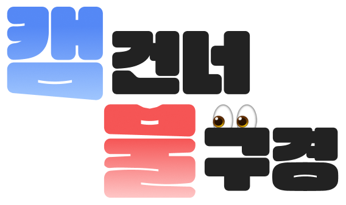
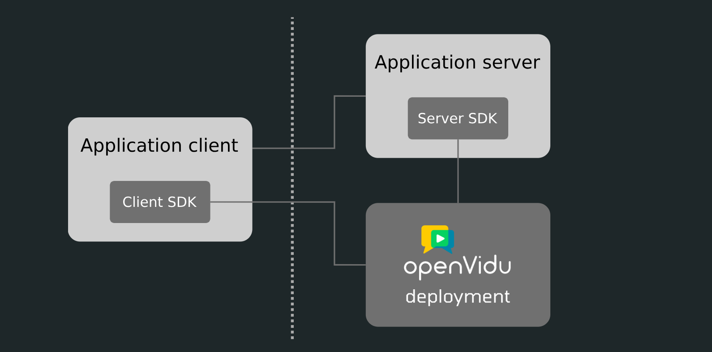
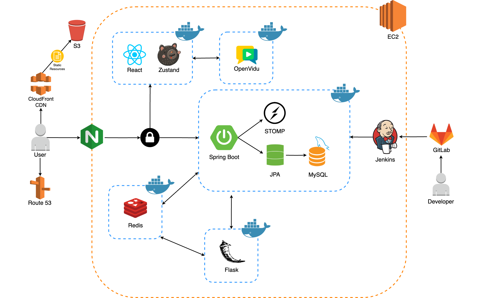
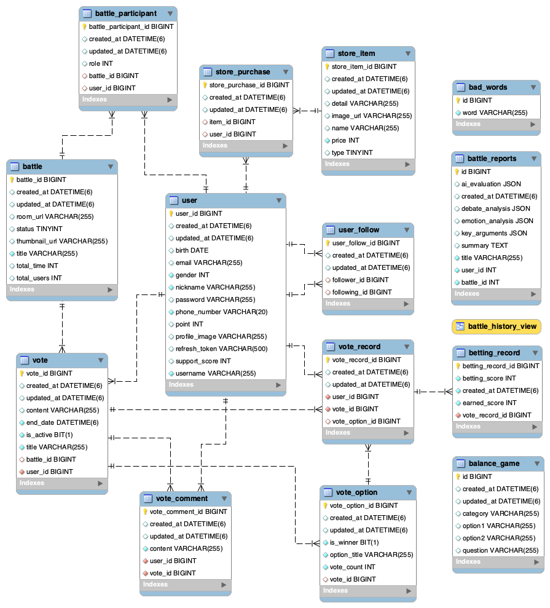
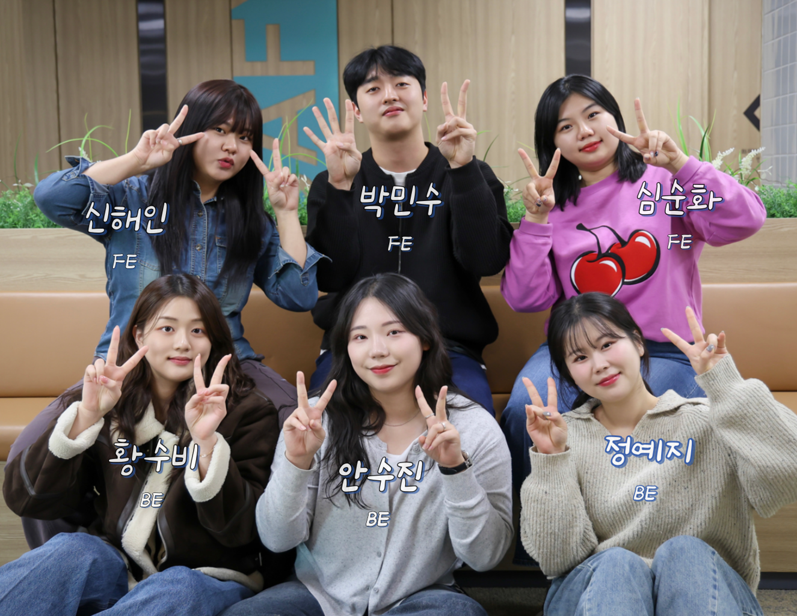

# YES204 팀의 "캠건너 불구경" 서비스 입니다.

  

> **재미에 의한, 재미를 위한.**  
> 실시간 논쟁이 필요한 사람들을 위한 화상 배틀 플랫폼  
>  
> 친구와 의견이 다를 때, 동료와 입장이 갈릴 때,  
> **실시간 화상 배틀 + 투표 & 배팅으로 승자를 가려보세요!**  

🔗 [캠 건너 불구경 바로가기](https://overthecam.site)  
📽 [시연 영상 바로가기](https://youtu.be/7E-xV0dhKd4)  
📝 [회의록 보기](https://romantic-blanket-13b.notion.site/YES-204-OverTheCam-1739cee6017880c89ac1fa8ccee63de8?pvs=4)  

---

## 🗂️ 서비스 둘러보기

- [🔥 캠건너 불구경 서비스 소개](#yes204-팀의-캠건너-불구경-서비스-입니다)
- [⏰ 개발 기간](#-개발-기간)
- [💡 기획 배경](#-기획-배경)
- [🎯 목표 및 주요 기능](#-목표-및-주요-기능)
- [🔧 기능 소개](#-기능-소개)
- [📢 기술 스택 소개](#-기술-스택-소개)
- [🔍 시스템 아키텍처](#-시스템-아키텍처)
- [💾 ERD 다이어그램](#-erd-diagram)
- [👥 팀 소개 및 역할](#-team-yes204)

---

## ⏰ 개발 기간
2025.01.06~2025.01.26 (3주) 기획, 설계

2025.01.27~2025.02.21 (4주) 개발

## 💡 기획 배경
누구나 살아가면서 주변 사람들과 논쟁을 하게 됩니다. 가벼운 밸런스 게임부터 인간관계에서 부딪히는 문제까지, 사람들은 서로 다른 의견을 주장하며 상대를 설득하려 합니다.

하지만 의견 조율이 되지 않고, 오랜 시간 논쟁을 진행할 때도 있습니다. 이런 경우 제삼자의 의견을 통해서 서로의 입장을 조율 하기도 합니다.

논쟁을 통해 서로 더 가까워지고, 보다 즐겁게 해결하기 위해서 실시간 판정단 시스템이 결합된 화상 채팅 기반 논쟁 배틀 서비스를 기획했습니다.

## 🎯 목표 및 주요 기능

#### 1. 건설적인 토론 문화 형성

- 논쟁의 흐름을 정리하고 감정 분석을 통해 객관적인 피드백을 제공하는 발화 분석 리포트 제공
- 감정적인 충돌을 막고 건강한 토론 문화를 위해서 채팅창 및 투표 커뮤니티에 욕설 필터링 도입

#### 2. 재미있게 논쟁하기

- 판정단도 논쟁에 즐겁게 참여할 수 있도록 투표 시 응원점수 배팅 및 획득 시스템 도입
- 다른 사람들의 생각이 궁금하거나, 가벼운 논쟁을 위한 투표 커뮤니티 도입

## 🔧 기능 소개

서비스의 주요 기능들을 소개합니다.

### ✅ 온보딩

- 서비스의 핵심 가치와 사용법을 애니메이션으로 소개하여 신규 사용자의 이해도 향상

### ✅ **회원가입**

- 간편한 회원가입 절차로 빠르게 서비스에 참여 가능

### ✅ **홈 화면**  

- 인기 있는 투표와 실시간 논쟁 배틀방을 한눈에 볼 수 있는 대시보드 형태의 메인화면

### ✅ **커뮤니티 투표**

- 다양한 주제에 대한 실시간 투표 참여와 결과 시각화, 댓글 기능을 통한 활발한 의견 교환
- 댓글 작성 시 비속어 필터링이 적용되어 건전한 커뮤니티 환경 유지

### ✅ **배틀 대기 화면**  

- 배틀방 입장 후 참여자들과 채팅을 통한 소통 및 배틀 주제 선정
- 투표 생성 후 배틀러 역할 분배 및 준비 과정 진행

### 👑 **투표 생성 화면 (방장 모드)** 

- 논쟁 전 즉각적인 청중 반응을 확인할 수 있는 실시간 투표 시스템 생성

### 👑 **배틀러 선정 화면 (방장 모드)**

- 논쟁 전 논쟁할 배틀러를 선정

### ✅ **랜덤 주제 생성 화면**  

- 추천받은 랜덤 주제가 마음에 들 경우 해당 주제로 투표 생성 가능 

### ✅ **배틀 진행 화면**  

- 배틀러 선정 완료 후 방장의 시작 버튼으로 실시간 화상 논쟁 시작

### ✅ **배팅 화면 (판정단 모드)**

- 판정단은 선호하는 배틀러에게 응원점수를 배팅하여 논쟁 참여도 향상
- 전체 판정단 중 현재 배팅 완료한 인원수 확인 가능

.gif)

### ✅ **승패 판정 및 실시간 발화분석 리포트 (배틀러 모드)**  

- 배틀 종료 시 판정단 투표 결과에 따른 승패 결정 및 응원점수 정산 결과 확인

- 배틀러에게는 BERT 모델 기반 실시간 발화 분석 리포트 제공(토론 요약, 감정 분석, 종합 평가 등)

### ✅ **비속어 필터링**

- Aho-Corasick 알고리즘 기반 실시간 비속어 필터링으로 클린한 서비스 환경 제공
- 채팅과 커뮤니티 투표 댓글에 적용되어 건전한 토론 문화 조성

### ✅ **검색 및 팔로우 기능**

- 키워드 기반으로 배틀방, 투표, 사용자를 통합 검색하여 원하는 콘텐츠에 빠르게 접근 가능

- 관심 있는 사용자를 팔로우하여 지속적으로 활동을 확인할 수 있는 소셜 네트워크 기능

### ✅ **상점**

- 배틀에서 획득한 포인트로 프로필 아이템과 배틀 효과를 구매할 수 있는 인게임 상점

### ✅ **마이페이지**

- 개인 배틀 전적, 참여 내역, 팔로워 관리 기능 제공
- 참여한 배틀의 맞춤형 발화 분석 리포트로 토론 스타일 개선 지원

---

 

## 📌 기술 스택 소개

### OpenVidu

OpenVidu는 WebRTC 기술을 기반으로 실시간 애플리케이션을 구현할 수 있는 플랫폼입니다. 

OpenVidu 아키텍쳐는 아래와 같습니다.

  

실시간 미디어 스트리밍 인프라와 클라이언트, 서버로 구성됩니다.

우리 서비스는 WebRTC 기술을 직접 구현하지 않고, Openvidu 플랫폼을을 커스텀하여 배틀방 기능을 구현했습니다.

 

### **📢 Tech Stack**  

#### **Frontend**  

#### **Backend**  

#### **Build & Deployment**  

#### **Database & Cache**  

#### **Infrastructure**  

---

 

## **🔍 시스템 아키텍처**  

  

## **💾 ERD Diagram**  

  

---

 

## **👥 Team YES204**  

팀 YES204는 프론트엔드 3명, 백엔드 3명으로 구성된 팀입니다!

# YES204 팀의 "캠건너 불구경" 서비스 입니다.

| 👑Frontend | Frontend | Frontend | 👑Backend | Backend | Backend |
|----------|----------|----------|----------|----------|----------|
| [순화](https://github.com/SunaS2) (팀장) | [해인](https://github.com/stitchzzang) | [민수](https://github.com/parkminsu6421) | [수진](https://github.com/ssuzyn) (팀장) | [수비](https://github.com/SubiHwang) | [예지](https://github.com/ygjeong5) |

 

## 👥 팀원 별 역할

### FrontEnd Developer

#### 🧑‍💻 순화 - 프론트 팀장

- OpenVidu 3, Stomp & SockJS 활용 실시간 화상 논쟁 배틀방 구현
- 발화 분석 리포트를 위한 React Speech Recognition 기반 STT 구현
- 상점 시스템 구현
- 사용자 경험 최적화를 위한 UI/UX 설계 및 개발

#### 🧑‍💻 해인

- Figma를 활용한 프로토타입 제작, 로고 및 테마 컬러 선정
- 온보딩 / 메인 페이지 - Framer Motion 애니메이션 적용 및 이미지 프리로딩 최적화
- 커뮤니티 투표 - 투표 및 댓글 CRUD 기능, 실시간 투표 시각화(Progress Bar, Confetti)
- 검색 페이지 - 멀티 엔드포인트 통합 검색 및 Zustand 상태 관리 구현
- 배틀 방 랜덤 주제 생성기 구현 - 슬롯 머신 효과 및 keyframes 애니메이션 구현
- 회원가입, 로그인, 배틀/투표 생성 폼 - SVG 그래피킹 및 CSS 애니메이션 적용

#### 🧑‍💻 민수

- 사용자 인증 시스템 (로그인, 회원가입, 정보 관리) 구현
- 마이페이지 탭 UI 및 팔로워/팔로잉 실시간 업데이트
- 발화 리포트 및 감정 분석 결과 시각화
- 상점 시스템 및 인벤토리 관리 구현

### BackEnd Developer

#### 🧑‍💻 수진 - 백엔드 팀장

- 배틀방 투표/정산 시스템 구현 (Redis 락 기반 동시성 제어)
- 실시간 논쟁 배틀방 통신 시스템 설계 (WebSocket+STOMP 프로토콜)
- 비속어 필터링 시스템 개발 (Aho-Corasick 알고리즘)
- 사용자 팔로우 기능 및 통계 시스템 개발
- 토큰 관리 및 다중 로그인 제한 시스템 개발 (Redis 기반 세션 관리 및 블랙리스트 적용)

#### 🧑‍💻 수비

- Docker, Jenkins CI/CD, AWS EC2, Nginx를 활용한 통합 인프라 구축
- OpenVidu 프레임워크 기반 실시간 배틀방 구현
- BERT 모델 활용 실시간 발화 분석 시스템 구축
- AWS S3와 CloudFront CDN 연동 이미지 관리 시스템 구현

#### 🧑‍💻 예지

- JWT 기반 로그인 및 로그아웃 구현
- AI 허브 감정 태깅 데이터셋 활용한 5만여 개 학습 데이터 전처리
- BERT 모델 기반 화상 토론 실시간 감정 분석 시스템 구축
- 커뮤니티 투표 CRUD 구현
